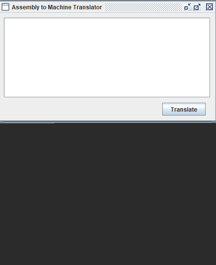

# Assembler
An assembly to machine language translator, using a Java Finite State Machine.

In order to obtain a better understanding of both Java and lower-level architecture, I built an Assembly to Machine Language Compiler. It takes a string of Assembly commands, identifiers, and instructions, and converts them directly into Machine Code through the implementation of a Finite State Machine.

## Assembler Demo

## Addressing Instructions:
The compiler is able to distinguish and translate the following mnemonic instructions:

STOP
Arithmetic Shift Left (ASLA)
Arithmetic Shift Right (ASRA)
.BLOCK
Branch (BR)
Branch if Equal to (BREQ)
Branch if Less Than or Equal To (BRLE)
Branch if Less Than (BRLT)
Decimal Input Trap (DECI)
Decimal Output Trap (DECO)
Load Word Accumulator (LDWA)
Store Word Accumulator (STWA)
Substract from Accumulator (SUBA)
Add to Accumulator (ADDA)
Addressing Modes:
Assembler accommodates indirect, direct, stack, stack-relative deferred, indexed, stack-indexed, stack-index deferred, and immediate addressing. Additionally, the program can distinguish and translate both Decimal and Hexadecimal numeric values.

## Pep9
The machine code my program produces is in accordance with the Pep9 Machine Code compiler, which is what my department uses at Pepperdine University. If you’d like to try running the resulting machine code yourself, feel free to check out the application here.

I will post an in depth walk-through of the grammar, the finite state machine, and the mechanics behind this program very soon, just as I have done with my other portfolio objects. Stay tuned!

For now, feel free to check out the source code on my GitHub!
